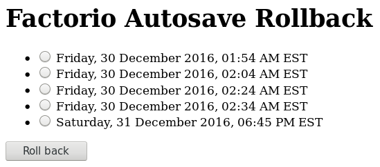

# Factorio Autosave Rollback

I wrote this because losing expensive items on death in multiplayer contrasts
harshly with the ease of reloading in single player. This Flask app allows
rolling back to an autosave.

## Requirements

* Linux
* `sudo`
* That the Factorio server is a systemd service, like that provided by
[factorio-init](https://github.com/Bisa/factorio-init)
* Python
* [flask-wtf](https://flask-wtf.readthedocs.io/en/stable/)

## Suggested

* [virtualenv](https://virtualenv.pypa.io/en/stable/)
* [virtualenvwrapper](https://virtualenvwrapper.readthedocs.io/en/latest/)
* Apache with `mod_wsgi`

## Installation

* Clone this repository, and change to its directory.
* Create a virtual environment: `mkvirtualenv rollback`
* Install the app: `setup.py install`
* Copy `config_sample.py` to `config.py`, and edit its contents accordingly.
* Allow the user running this app to start and stop the Factorio server.
  That user must also be able to read and change the modification time of
  Factorio saves, so it should probably be the same user running the Factorio
  server.

  Use `visudo` to add the following:

      # Allow the factorio user to start and stop Factorio without a password
      factorio ALL=NOPASSWD: /bin/systemctl start factorio
      factorio ALL=NOPASSWD: /bin/systemctl stop factorio

Now depending on whether you'd rather use Apache `mod_wsgi` or the built-in
Flask server:

### Apache mod_wsgi

This method is recommended because it allows for password protection. Anyone
with access to this app can roll back autosaves.

* Set up `mod_wsgi` using `factorio_rollback.wsgi` according to the [Flask
  mod_wsgi](http://flask.pocoo.org/docs/0.12/deploying/mod_wsgi/) and
  [mod_wsgi](https://modwsgi.readthedocs.io/en/develop/user-guides/quick-configuration-guide.html)
  documentation. The committed `.wsgi` assumes Python 3 and a specific
  virtualenv and config path; see the [virtual environments](http://flask.pocoo.org/docs/0.12/deploying/mod_wsgi/#working-with-virtual-environments)
  section of the documentation for more information. If you're like me and use
  an SSL certificate with a redirect from HTTP to HTTPS, ensure you're editing
  the HTTPS VirtualHost.

  Using Debian Jessie I've run into odd problems and ended up doing odd
  things rather than what seemed like should work:

  * VirtualEnv problems: Even if `WSGIDaemonProcess python-home` or
    `WSGIPythonHome` are set to the `sys.prefix` given by a Python shell in a
     VirtualEnv in which `import factorio_rollback` succeeds, `mod_wsgi`
     encounters `ImportError: No module named factorio_rollback`.
  * Despite [the documentation](https://modwsgi.readthedocs.io/en/develop/user-guides/application-issues.html#application-environment-variables)
    suggesting otherwise:

    > Variables in the WSGI environment could be set by a WSGI middleware
      component, or from the Apache configuration files using the SetEnv
      directive.

  `SetEnv FACTORIO_ROLLBACK_CONFIG_PATH /path/to/config.py` in the
  Apache configuration file does not set the variable:

      RuntimeError: The environment variable 'FACTORIO_ROLLBACK_CONFIG_PATH'
      is not set and as such configuration could not be loaded.  Set this
      variable and make it point to a configuration file

  So hopefully that explains the weirdness in `factorio_rollback.wsgi`. I
  ended up with this in my `VirtualHost` directive:

      WSGIDaemonProcess factorio_rollback user=factorio group=factorio threads=5
      # TODO: ImportError if WSGI python-home / PythonHome is set? Only works with activate-this.
      # python-home=/home/factorio/.virtualenvs/rollback/
      WSGIScriptAlias /factorio /var/www/factorio/factorio_rollback.wsgi process-group=factorio_rollback application-group=%{GLOBAL}
      WSGIScriptReloading On
      # TODO: This doesn't set the variable for the interpreter.
      SetEnv FACTORIO_ROLLBACK_CONFIG_PATH /home/factorio/factorio_rollback/config.py

      <Directory /var/www/factorio>
          WSGIProcessGroup factorio_rollback
          WSGIApplicationGroup %{GLOBAL}
          Require all granted
      </Directory>

  If I ever figure this out I intend to update this section and [the Flask
  documentation](https://github.com/pallets/flask/issues/1948).
* Add [password protection](https://httpd.apache.org/docs/current/howto/auth.html).

### Standalone

* Run `env FACTORIO_ROLLBACK_CONFIG_PATH=path/to/config.py FLASK_APP=factorio_rollback flask run`

## Implementation

The root page ("/") displays a radio button form with the modification times of
the available autosaves: files matching "_autosave*.zip". The form has CSRF
protection provided by Flask-WTF.

The rollback page ("/rollback") acquires a lock file to prevent overlapping
rollbacks, stops the server, updates the access and modification time of the
requested save, and starts the server again.
